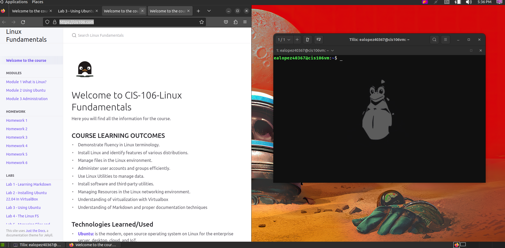
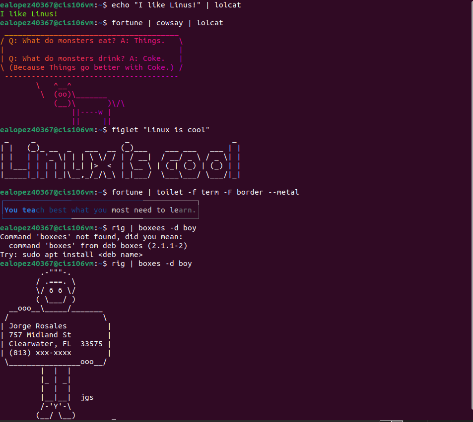

---

Name:Edwin Lopez
Semester: fall 23
Course: cis 106 Linux Fundamental

---

# Lab 3 submission 

## Question 1

No submission required

## Question 2 

## Question 3

| Program name         | Package Name     | Version       |
| -------------------- | ---------------- | ------------- |
| Play a tetris Game   | Block attack     | 2.7.0-1       |
| Play Vide file       | dragonplayer     | 21.12.3       |
| Brrowse the internet | epiphany-browser | 42.4-0ubuntu1 |
| Read your email      | Geary            | 40.0-2        |
| Play music           | cmus             | 2.9.1-1       |

## Question 4

| command | What it does                              |
| ------- | ----------------------------------------- |
| echo    | It reads what you wrote                   |
| Fortune | it puts a random quote or fortune         |
| cowsay  | It draws a cow with some text             |
| lolcat  | print the line you wrote iin color        |
| figlet  | it draws a large sized text banner        |
| toilet  | it draws a banner using smaller character |
| Rig     | creates names and addresses               |

